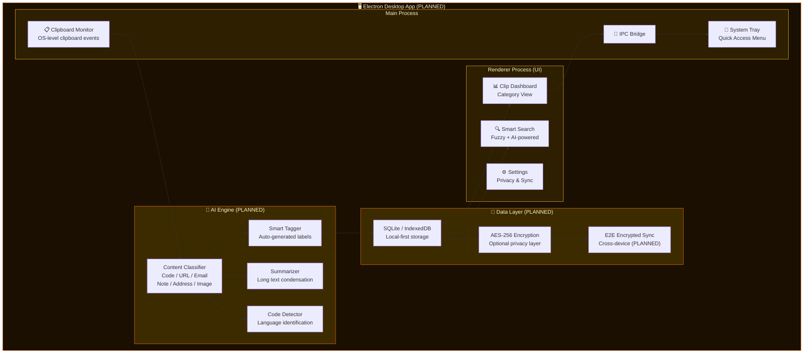
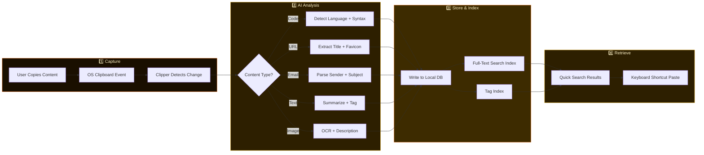
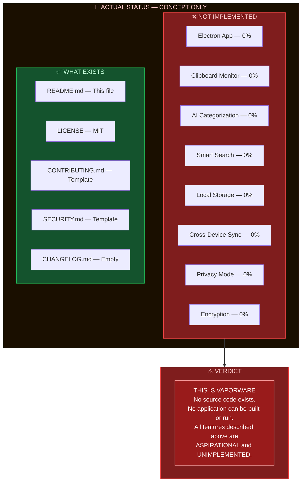

<!-- BANNER -->


<!-- TYPING SVG -->
<div align="center">
  <a href="https://git.io/typing-svg">
    
  </a>
</div>

<br/>

<!-- BADGES -->
<div align="center">

[](https://www.typescriptlang.org/)
[](https://www.electronjs.org/)
[](./LICENSE)

</div>

---

## Overview

**Clipper AI** is an AI-powered clipboard manager that automatically categorizes, tags, and makes searchable everything you copy. Text snippets, URLs, code blocks, images — Clipper AI understands what you've copied and organizes it so you can find it later without digging through a chaotic clipboard history.

## Features

### AI-Powered Organization
- **AI Categorization** — Automatically classifies clipboard content (code, URLs, emails, addresses, notes, etc.)
- **Smart Tags** — AI-generated tags for each clip for effortless retrieval
- **Content Summarization** — Brief summaries of long copied text
- **Code Detection** — Identifies programming language and adds syntax context

### Search & Access
- **Smart Search** — Find anything by content, category, or AI-generated tags
- **Quick Paste** — Keyboard shortcuts for instant access to favorite clips
- **Fuzzy Matching** — Find clips even with partial or approximate search terms
- **Pin Favorites** — Pin frequently used clips for one-key access

### Privacy & Security
- **Privacy Mode** — Exclude sensitive apps from clipboard monitoring
- **Auto-Clear** — Automatically remove clips containing sensitive patterns (passwords, tokens)
- **Local-First** — All data stored locally by default
- **Encryption** — Optional encryption for stored clipboard history

### Sync & Sharing
- **Cross-Device Sync** — Optional end-to-end encrypted sync between your devices
- **Clip Sharing** — Share specific clips with teammates via secure links

## Honest Notes

- **Early Stage** — Clipper AI is under active development. Features may change and bugs are expected.
- **AI Categorization Accuracy Varies** — The AI does a good job with common content types but may misclassify unusual or ambiguous content. Manual correction is sometimes needed.
- **Platform Support** — Currently focused on desktop (Electron). Mobile support is planned but not yet available.
- **Clipboard Access** — The app monitors your clipboard continuously. While privacy mode helps, be mindful of what you copy while the app is running.

## Quick Start

### Prerequisites
- Node.js 18+
- LLM API key for AI categorization features

### Installation

```bash
git clone https://github.com/mulkymalikuldhrs/Clipper-AI.git
cd Clipper-AI
npm install
cp .env.example .env
```

### Configuration

```env
OPENAI_API_KEY=your_key
SYNC_ENABLED=false
ENCRYPTION_KEY=your_optional_key
```

### Running

```bash
# Development
npm run dev

# Build desktop app
npm run build:electron
```

## Project Structure

```
Clipper-AI/
├── src/
│   ├── main/           # Electron main process
│   ├── renderer/       # UI components
│   ├── lib/
│   │   ├── clipboard/  # Clipboard monitoring
│   │   ├── ai/         # AI categorization engine
│   │   ├── search/     # Search & indexing
│   │   ├── sync/       # Cross-device sync
│   │   └── privacy/    # Privacy & encryption
│   └── types/          # TypeScript definitions
└── tests/              # Test suites
```

## Visual Architecture

### Planned Architecture (NOT YET BUILT)



### Planned Clipboard Pipeline (NOT YET BUILT)



### Implementation Status — BE HONEST



> **Brutally Honest:** Clipper AI is vaporware. There is no source code, no working application, and no functional prototype. The features described in this README represent a concept and wish list — nothing more. The `npm install` and `npm run dev` commands listed above will not work because no code has been written. This project exists as an idea and documentation only.

---

## Contributing

1. Fork the repository
2. Create a feature branch
3. Add tests for new functionality
4. Submit a pull request

Especially welcome: better categorization models, new platform support, and UI improvements.

## Disclaimer

Clipper AI accesses your clipboard contents for categorization. While privacy mode excludes specified apps, be aware of what you copy. The authors are not responsible for any data exposure through the clipboard manager.

## License

**MIT License** — see [LICENSE](./LICENSE) for details.

## Author

<div align="center">

**Mulky Malikul Dhaher**

[](https://github.com/mulkymalikuldhrs)
[](mailto:mulkymalikudhr@mail.com)

</div>

---

<!-- FOOTER BANNER -->

